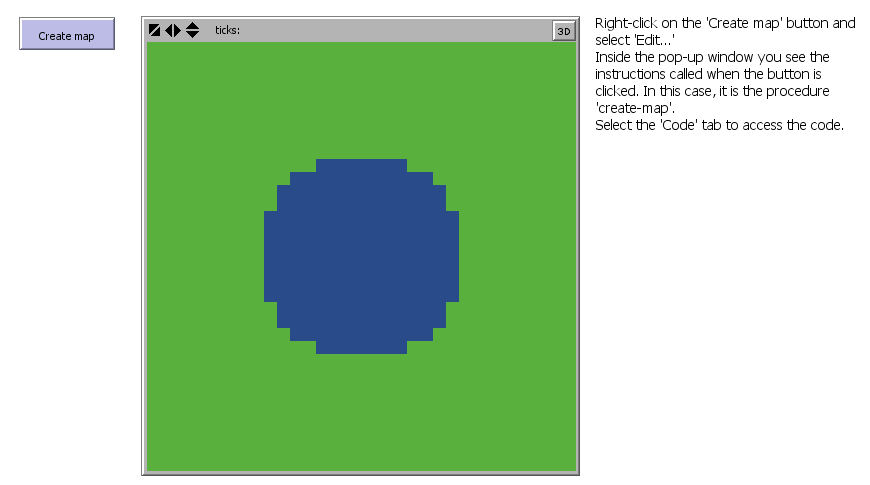
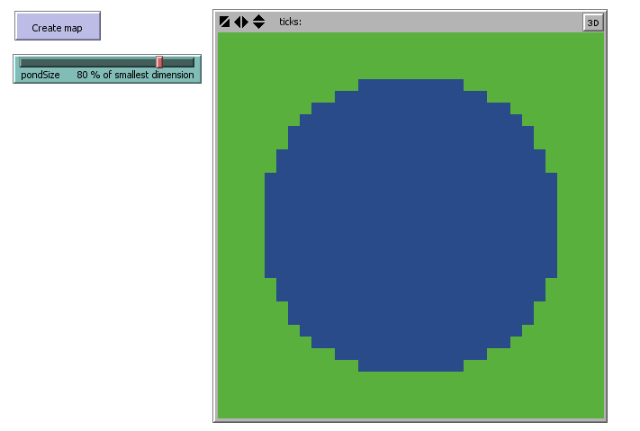
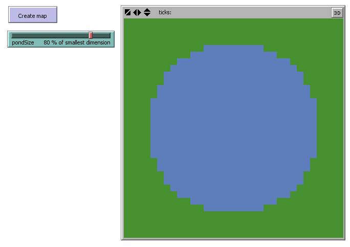
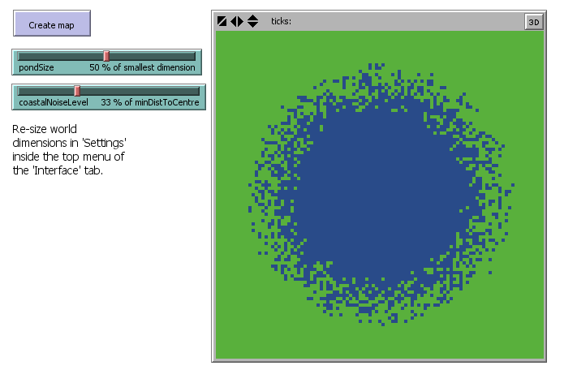
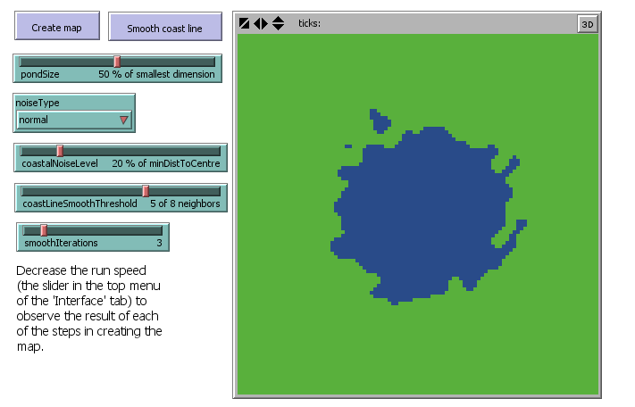

[](https://doi.org/10.5281/zenodo.3881974)

# Pond Trade model: Didactic progressive development of an Agent-based model in NetLogo

This is an Agent-based model (ABM) created explicitly for exemplifying several aspects of the development of ABM models. The target public is students and researchers of Archaeology and History. The development process is broken down into several steps that are progressively complex, each introducing a new concept and NetLogo functionalities. Each step corresponds to a ".nlogo" file included in this repository. Although ".nlogo" files should be opened in NetLogo to run their code, they can also be opened and edited in any text editor.

>NOTE: In the explanation below, I'm using `<UPPERCASE_TEXT>` to express the positions in the code to be filled by the names of entities, variables, and other elements, depending on the context. For instance, `<COLOR> <FRUIT>` would represent many possible phrases, such as "red apple", "brown kiwi", etc. 

## NetLogo basics

### Hello World!

In NetLogo, any action we want to perform must be enclosed within a structure of the type:
```NetLogo
to <PROCEDURE NAME>
  <PROCEDURE_ACTION_1>
  <PROCEDURE_ACTION_2>
  <PROCEDURE_ACTION_3>
  ...
end
```
Any procedure can be executed by typing `<PROCEDURE_NAME>` + Enter in NetLogo's console at the bottom of the 'Interface' tab. The "Hello World" program, a typical minimum exercise when learning a programming language, correspond to the following procedure `hello-world`:
```NetLogo
to hello-world
  print "Hello World!"
end
```
which generates the following "prints" in the console:
```
observer> hello-world
Hello World!
```
NetLogo's interface editor allows us to create buttons that can execute one or multiple procedures (or even a snippet of *ad hoc* code). The interface system is relatively straightforward. First, at the top of the interface tab, click "Add," then select an element type from the drop-down list. Click anywhere in the window below to place it. Select it by clicking and dragging or using the "Select" option in the right-click pop-up menu. You can edit the element by selecting "Edit", also in the right-click pop-up menu. If you have any doubts on how to edit the interface tab, please refer to NetLogo's documentation (https://ccl.northwestern.edu/netlogo/docs/interfacetab.html).

### NetLogo's entities

The first thing one should learn about NetLogo (and most agent-based modelling systems) is that it handles *mainly* two types of entities/agents: `patches`, cells of a square grid, and `turtles`, which are proper "agents" (i.e., mobile, autonomous entities). Both entities have *primitives* (built-in, default properties), some of which can be modified by processes in your model. For example, you can't move a patch, but you can change its fill colour. See NetLogo's documentation on agents for further details (https://ccl.northwestern.edu/netlogo/docs/programming.html#agents).

### Grid

One should spend some time understanding the grid structure and associated syntax. It is recommended to consult the "settings" pop-up window in the "interface tab":


The default configuration is a 33x33 grid with the position (0,0) at the centre. Both dimensions and the centre can be easily edited for each particular model. Moreover, we can specify agents' behaviour at the borders by ticking the "wrap" options. Wrapping the world limits means that, for instance, under the default setting mentioned above, the position (-16,0) is adjacent to (16,0). In the console, we can "ask" the patch at (-16,0) to print its distance to the patch at (16,0), using the primitive function `distance` (https://ccl.northwestern.edu/netlogo/docs/dictionary.html#distance):
```
observador> ask patch -16 0 [ print distance patch 16 0 ]
1
```
Wrapping one dimension represents a cylindrical surface, while wrapping two depicts a strange toroidal object (Doughnut!). Although this aspect is relatively hidden among the options, it can be highly important if spatial relations play a role in a model. So if you want your grid to represent a geographical map, make sure to untick the wrapping features.

### NetLogo's *dictionary*

One of the most valuable resources in NetLogo's documentation is the *dictionary*, which can be accessed from the "Help" menu. This is true at any moment throughout your learning curve, even when you know all *primitives* and built-in functions by heart. Moreover, all documentation is present with any copy of NetLogo, so it is fully available offline. 

The dictionary is handy whenever you are learning by example, as in our case. For instance, regarding the earlier mention of `distance`, you could have searched it in the dictionary directly. Whenever you find yourself reading NetLogo code with violet or blue words that you do not understand, take the habit of searching them in NetLogo's *dictionary*.

## Step 0: Drawing a blue circle

This is the actual initial step in building the **Pond Trade** model. It introduces the student to several fundamental concepts of NetLogo's programming language.

### Procedures

Inside a single procedure, called `create-map`, the code illustrates how all entities of a type (`patches`) can be ordered (`ask`) to do something using the structure: 
```NetLogo
ask <ENTITIES>
[ 
  <DO_SOMETHING>
]
```

### Variables

The code also introduces the syntax to set the values of variables, i.e. `set <VARIABLE> <VALUE>` (in this case, to change colour):
```NetLogo
set pcolor blue
```
and to declare and set local variables (i.e., accessible only from its own context) by using `let <VARIABLE> <VALUE>`. In this case, for instance, we use a local variable to identify the patch at the position (0,0) as the one at the centre:
```NetLogo
let centralPatch patch 0 0
```
The fact that the `centralPatch` variable is local and placed inside `ask patches [ <ACTIONS> ]` structure means that we are creating and destroying a different variable for every patch. We cannot use these variables (plural intended) outside their enclosing brackets and patches hold no memory of their values before or after this particular action.

### Commenting code

Furthermore, we show how to "comment" (i.e., write text that should be ignored when executing the code) using the structure:
```NetLogo
; <FREE_TEXT>
```
or
```NetLogo
<CODE> ; <FREE_TEXT>
```

### Conditional bifurcation: `if` and `ifelse`

The code exemplifies how to create conditional rules according to predefined general conditions using if/else statements, which in NetLogo can be written as `if` or `ifelse`:
```NetLogo
if (<CONDITION_1_IS_TRUE>)
[
  <DO_ACTION_A>
]

ifelse (<CONDITION_2_IS_TRUE>)
[
  <DO_ACTION_B>
]
[
  <DO_ACTION_C>
]
```
In this step, we are ordering patches to paint themselves green or blue depending on whether their distance to the centre is less than a given value.
```NetLogo
ifelse (distance centralPatch < minDistOfLandToCentre)
[
  set pcolor blue ; water
]
[
  set pcolor green ; land
]
```

### Expressing equations

To calculate the if/else condition for every patch, we must set up the arbitrary value of `minDistOfLandToCentre`, i.e., *the minimum distance of a land patch to the centre patch*. We want our pond to be entirely within the grid, but also occupy a significant part of the space. This can be accomplished by setting `minDistOfLandToCentre` to be equal to *the rounded half of half of the grid width* or *a quarter of the grid width*.

### Result

The whole code is kept short so these aspects can be better observed, investigated, and assimilated:
```NetLogo
to create-map

  ask patches [

    ; set central patch
    let centralPatch patch 0 0

    ; set minimum distance to centre depending on world width
    let minDistOfLandToCentre round (0.5 * (world-width / 2))

    ifelse (distance centralPatch < minDistOfLandToCentre)
    [
      set pcolor blue ; water
    ]
    [
      set pcolor green ; land
    ]

  ]

end
 ```



## Step 1: Replacing *magic numbers*

This step exemplifies a very typical situation in model design and programming in general. Once you have defined a procedure in raw terms and tested that it does what you expect, you probably want to generalise it. As the aim of modelling is to represent *a type of* phenomenon, it's good practice to have all non-dynamic conditions to be isolated as "parameters", variables that can be set through user input in the interface tab (e.g., slides, selectors, numeric fields).

In Step 0, the code contains several arbitrary fixed values (e.g., the coordinates of the `centralPatch`, and the calculation of `minDistOfLandToCentre` assuming half the world width). It is good enough for us to draw a *particular* blue circle, but it is insufficient to draw other *types of blue circles*. Of course, the code will never be able to draw *anything* unless we program it to do so. For instance, the colours "blue" and "green" are also "magic numbers", but we are hardly interested in having them as parameters. We must generalise while also compromising, accepting that there will be possibilities our model does not cover.

### Adaptable "pond"

One of the fixed values we may want to generalise is the central patch being described as `patch 0 0`, and the pond (blue circle) as a circle with a radius equal to a quarter of the grid width.

First, is there any case where this patch is not the one at the centre of the grid? Imagine you don't want negative coordinates in your model. Back in Step 0, go to "Settings" and set the "location of origin" to the corner. Now, test the `create-map` procedure:


A true mess! Not at all what we are looking for! To correct this behaviour, we must calculate the centre coordinates based on the grid's width and height, regardless of its configuration. Therefore, we must replace "0" with the calculation "minimum + range / 2" for both x and y coordinates:
```NetLogo
let centralPatch patch (min-pxcor + floor (world-width / 2)) (min-pycor + floor (world-height / 2))
```
We use the `floor` function to obtain the floor of the lower grid position when the range is an odd number. Because this calculation uses only NetLogo primitives, you can test this by printing it in the console in any NetLogo model. It will return the central patch given your grid settings:
```NetLogo
observer> show patch (min-pxcor + floor (world-width / 2)) (min-pycor + floor (world-height / 2))
observer: (patch 16 16)
```
Now, back to Step 0: imagine that you are interested in changing the grid's dimensions instead. Maybe you want the grid to be not square (e.g., 33x33) but rectangular (e.g., 100x20):


Again, not what we are looking for. We want our pond to always be entirely within the grid. To do this, we must modify our calculation of `minDistOfLandToCentre` to account for both width and height. One way to do it is to calculate the radii for both dimensions and choose the smallest one.
```NetLogo
let minXDistOfLandToCenter round 0.5 * (world-width / 2) ; minimum distance in X
let minYDistOfLandToCenter round 0.5 * (world-height / 2) ; minimum distance in Y
let minDistOfLandToCenter min (list minXDistOfLandToCenter minYDistOfLandToCenter)
```
| 100x20 | 20x100 |
| --- | --- |
|  |  |

### Parameterizing

After the latter changes, we still have two different kinds of "magic numbers". "2" represents the fact that we are drawing a circle whose radius is a proportion of *half* of the smaller grid dimension. Although it is possible, we will not replace this value with a parameter. As an exercise, you can imagine the outcome of having different numbers instead of "2".

On the contrary, "0.5" represents the relative size of the pond radius, i.e., the *half* of the *half of the smaller dimension*. Here we have a good candidate for a parameter. It is reasonable to assume that pond size will be relevant to our model's results. Mainly, we expect that larger ponds will slow trade, assuming a fixed number of settlements evenly distributed around the pond. In NetLogo, we create a parameter by adding an input element to the interface tab (e.g., a slider) and naming it. In this case, we create a parameter called "pondSize" that represents the pond radius as the percentage of the smallest dimension, i.e. varying between 0 and 100. Then, we can use it in the code to replace "0.5":
```NetLogo
let minXDistOfLandToCenter round ((pondSize / 100) * (world-width / 2)) ; minimum distance in X
let minYDistOfLandToCenter round ((pondSize / 100) * (world-height / 2)) ; minimum distance in Y
let minDistOfLandToCenter min (list minXDistOfLandToCenter minYDistOfLandToCenter)
```
Note that this parameter could be expressed directly as a proportion varying between 0 and 1. However, I recommend using percentages to format these kinds of parameters because they are more intuitive for humans and easier for colleagues and the general public with no background in computer science or mathematics to understand.

### Result

We significantly improved the `create-map` procedure, and we now have a process that is both flexible and controllable via user input. Note that we extract the declarations of the local variables `centralPatch` and `minDistOfLandToCenter` from the patches commands. They are now calculated only once at the start of the procedure and then used by every patch. Once you close a version of any piece of code, it is good practice to increase the spacing between the lines or even break down single lines that are particularly complicated. The NetLogo language offers considerable flexibility in this regard: you can add spaces, tabs, line breaks, and comments between most elements of your code. Also, enclosing parentheses are not required, but may improve readability.
```NetLogo
to create-map

  ; find the central patch, depending on the size of the dimensions
  let centralPatch
    patch
    ; position in X
    (
      min-pxcor +
      floor (world-width / 2)
    )
    ; position in Y
    (
      min-pycor +
      floor (world-height / 2)
    )
  print(centralPatch) ; print central patch

  ; find the minimum distance of land patches to the central patch, depending on the size of dimensions
  let minXDistOfLandToCenter round ((pondSize / 100) * (world-width / 2)) ; minimum distance in X
  let minYDistOfLandToCenter round ((pondSize / 100) * (world-height / 2)) ; minimum distance in Y
  let minDistOfLandToCenter min (list minXDistOfLandToCenter minYDistOfLandToCenter)

  ask patches [

    ifelse (distance centralPatch < minDistOfLandToCenter)
    [
      set pcolor blue ; water
    ]
    [
      set pcolor green ; land
    ]

  ]

end
```



## Step 02: Refactoring

Replacing "magic numbers" is part of what is often called "refactoring" in programming. By definition, refactoring means that your code changes its appearance while still producing the same result. Refactoring encompasses all tasks aimed at generalising the code, making it extendable, and making it cleaner (more readable) and faster. However, there is a trade-off between these three goals. Replacing default values with calculations or indirect values will likely increase the time of processing. In practice, this trade-off is relevant only when your model is very complex, very large (many entities), or must be simulated across many different conditions. I think you should always be especially attentive with the readability, commentary and documentation of your code. If you are interested in creating models for academic discussion (i.e., for scientific rather than engineering purposes), the priority is to make your models available to others.

### Pacing comments

We downgrade the extensive commentary on the calculation of `centralPatch`. Commenting on your code is excellent, but do not get carried away! You must assume that your reader knows *something* about the programming language. At every step, I will be downgrading most of the commentaries added in the previous step.

### Exploring alternative designs

We also simplify the calculation of `minDistOfLandToCenter`. This new version initialises a local variable `halfSmallerDimension`, assuming the smaller dimension is the width. Then it checks whether this is the case and rewrites the value if the height is actually smaller. Finally, we calculate `minDistOfLandToCenter` as a proportion of `halfSmallerDimension`. This version is less redundant, uses two local variables instead of three, and expresses more clearly that the condition compares the grid width and height.
```NetLogo
let halfSmallerDimension (world-width / 2)
if (world-width > world-height) [ set halfSmallerDimension (world-height / 2) ]

let minDistOfLandToCenter round ((pondSize / 100) * halfSmallerDimension)
```

### Colours and shades

Lastly, we replace the text references to colours with NetLogo's numerical codes. Using this numeric system allows us to use many shades of any given colour. In this case, we are selecting slightly different shades of blue (106) and green (54). You can consult the colour codes in "Tools" > "Color Swatches" or in http://ccl.northwestern.edu/netlogo/docs/programming.html#colors:


### End result

```NetLogo
to create-map

  let centralPatch patch (min-pxcor + floor (world-width / 2)) (min-pycor + floor (world-height / 2))

  ; refactor previous code for finding minimum distance to the centre
  let halfSmallerDimension (world-width / 2)
  if (world-width > world-height) [ set halfSmallerDimension (world-height / 2) ]

  let minDistOfLandToCenter round ((pondSize / 100) * halfSmallerDimension)

  ask patches
  [
    ifelse (distance centralPatch < minDistOfLandToCenter)
    [
      set pcolor 106 ; blue for water
    ]
    [
      set pcolor 54 ; green for land
    ]
    ;;; see "Tools > Color sample" to get the numerical values for different colours and shades
  ]

end
```



## Step 03: Adding noise (*stochasticity*)

One of the most essential characteristics of an agent-based model is stochasticity. This means that at least some of the processes are fed by random sequences. Methodologically, introducing randomness accounts for the full range of possibilities when a particular aspect of the model is undertheorized or cannot be controlled in real-world scenarios. More importantly, it is justified whenever the modeller believes that the intended behaviour is independent of a specific value or order. For those with no previous experience with computer science: note that "random" for a computer is not really like "rolling dice". We are, in fact, getting values of a preordered sequence that is presumably unrelated to the process at hand. The programs that generate these sequences are called "random number generators" (RNGs). Sequences will be different every time we run our program (*i.e.* simulation), unless we preset the RNG using a specific 'seed' (see http://ccl.northwestern.edu/netlogo/docs/dict/random-seed.html).

Stochasticity is intrinsic in NetLogo. We were already dealing with random processes since step 0, when asking patches to paint themselves. You probably did not realise, but the command `ask patches` demands that patches be ordered somehow. Think as if you were told to ask all your friends to have a look at your new model. Well, but who exactly are you going to ask first? NetLogo solves this dilemma automatically by randomising the order of "asking". As an exercise, you can open the step 0 model, reduce the velocity of simulation (top of the interface tab), and execute the `create-map` procedure. You will observe each patch changing colour, one at a time. This is also a nice example of using stochasticity to ensure that an aggregated outcome (*i.e.* the blue circle) is not a mere artefact of any particular process schedule (*i.e.* the order in which patches change colour).

But is it so important to have a random order? In the cases of step 0 through step 2, it is completely irrelevant. Our goal was to draw a blue circle; it does not matter which patch serves as land or water first. However, this will become increasingly relevant as we advance in creating a proper agent-based model, because *agents' states DO normally depend on other agents' states*. Following the scenario where you want to show your model to your friends, imagine that after one of them sees it, some of them talk more, and some are more respected. Can you assume that the order in which you present your model would not affect the level of publicity and prestige of your model? *'Don't think so'*, *'Who knows?!'*, *'Don't really care about it'*? If these thoughts cross your mind while addressing a process in your model, you are better off using stochasticity. 

### Spray pond

A perfect blue circle is great, but it is a poor representation of a real water body. Once we implement the model's dynamics, it will be quite difficult to explore the effect of geography solely by varying the pond's size. The first step to creating more interesting setups is to add noise to the condition used to determine whether a patch is land or water. NetLogo has a family of primitive functions, `random` and alike, that can be used to generate random discrete (integer) and continuous (float) values, following different probability distributions (e.g., uniform, normal, exponential).

For each patch, we sample a random continuous number, add it to the `minDistOfLandToCenter`, and use it as the threshold distance from the centre:
```NetLogo
let coastThreshold minDistOfLandToCenter + random-float (halfSmallerDimension * coastalNoiseLevel / 100)

ifelse (distance centralPatch < coastThreshold)
[
  set pcolor 106 ; blue for water
]
[
  set pcolor 54 ; green for land
]
```
The function `random-float <number>` returns a random "float" number greater or equal to 0.0 and lower than `<number>`. To stretch your learning skills, we are jumping a few minor steps in refactoring by defining a noise that is a portion of `halfSmallerDimension` and controllable through the parameter `coastalNoiseLevel`.

### End result

We can now generate strange "spray ponds". More importantly, we made the generation process controllable via two easily understandable parameters. Play with the parameters and meditate on their effects on the pond's shape.
```NetLogo
to create-map

  let centralPatch patch (min-pxcor + floor (world-width / 2)) (min-pycor + floor (world-height / 2))

  let halfSmallerDimension (world-width / 2)
  if (world-width > world-height) [ set halfSmallerDimension (world-height / 2) ]

  let minDistOfLandToCenter round ((pondSize / 100) * halfSmallerDimension)

  ask patches
  [

    ; add noise to coastline
    let coastThreshold minDistOfLandToCenter + random-float (halfSmallerDimension * coastalNoiseLevel / 100)

    ifelse (distance centralPatch < coastThreshold)
    [
      set pcolor 106 ; blue for water
    ]
    [
      set pcolor 54 ; green for land
    ]

  ]

end
```



## Step 04: Design alternatives, iterations, and print statements


### Design alternatives selectable in the interface 


### Iteration


### Print statements


### Result


```NetLogo
to create-map

  print "Creating map..."

  ; erase previous data
  clear-all

  let centralPatch patch (min-pxcor + (floor world-width / 2)) (min-pycor + (floor world-height / 2))

  let halfSmallerDimension (world-width / 2)
  if (world-width > world-height) [ set halfSmallerDimension (world-height / 2) ]

  let minDistOfLandToCenter round ((pondSize / 100) * halfSmallerDimension)

  print "Assigning initial patch types..."

  ask patches
  [

    let coastThreshold minDistOfLandToCenter ; defaults to the basic value

    ;; add noise to coast line
    ; set general noise range depending on UI's coastalNoiseLevel and the size of world
    let noiseRange (halfSmallerDimension * coastalNoiseLevel / 100)

    ; noiseType is specified with the chooser in the UI
    if (noiseType = "uniform")
    [
      ; adds a random amount from a uniform distribution with mean minDistOfLandToCenter
      set noiseRange (random-float noiseRange) - (noiseRange / 2)
      set coastThreshold minDistOfLandToCenter + noiseRange
    ]
    if (noiseType = "normal")
    [
      ; adds a random amount from a normal distribution with mean minDistOfLandToCenter
      set coastThreshold random-normal minDistOfLandToCenter noiseRange
    ]

    ifelse (distance centralPatch < coastThreshold)
    [
      set pcolor 106 ; blue for water
    ]
    [
      set pcolor 54 ; green for land
    ]

  ]

  print "done."

end

to smooth-coast-line

  print "Smoothing..."

  ; smooth coastline
  repeat smoothIterations
  [
    ask patches
    [
      ifelse (pcolor = 106)
      [
        ; water patch
        if (count neighbors with [pcolor = 54] >= coastLineSmoothThreshold)
        [
          ; water patch has a certain number of land neighbors
          set pcolor 54 ; converted to land
        ]
      ]
      [
        ; land patch
        if (count neighbors with [pcolor = 106] >= coastLineSmoothThreshold)
        [
          ; land patch has a certain number of water neighbors
          set pcolor 106 ; converted to water
        ]
      ]
    ]
  ]
  print "done."

end
```


